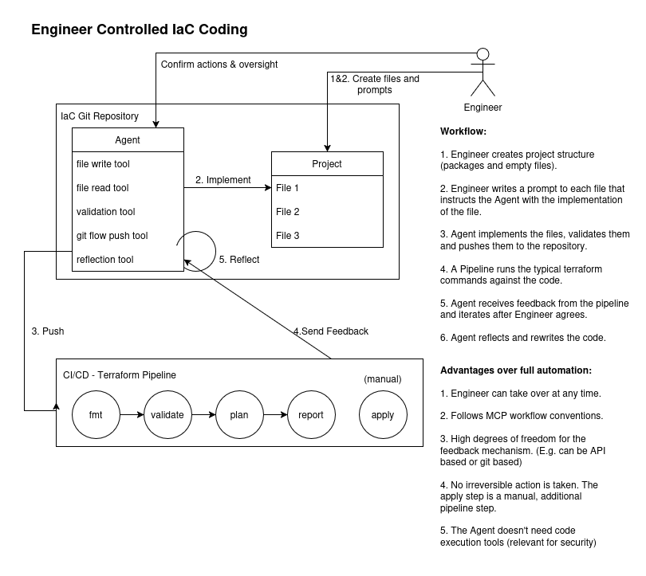

# Terraform Agent Concept

Developed in March 2025

## Introduction

The typical use cases of generative AI in businesses which adopt the technology, like documentation or Q&A assistance, are more general solutions for business environments rather than DevOps-specific.

This concept should display possibilities on how Agents could be used in the area of DevOps.

## Explanation

Based on state-of-the-art Agent architectures and workflows, this idea was built with the following focus in mind:

1. AI is a tool for engineers
2. Human oversight and full controllability
3. Security by design - the agent should be implemented in the MCP (Model Context Protocol) design pattern, to guarantee possible engineer interventions and action-transparancy

## Workflow

Please refer to the diagram displayed.

Note:
The current workflow displays the basic process capturing the most important aspects of the architecture. 

However, the archtictecture can be significantly enhanced by adding additional tools, data sources or interaction interfaces.

Recommendation: Add a scraper tool, specialized on terraform provider documentation. This significantly enhances accuracy and enables a broader model choice.

## Benefits

Generally, this Agent-tool could assist the DevOps Engineer by taking over trivial tasks, such as writing out the actual provider code, formatting and debugging in case of errors. 

However the main part of the engineer's work is preserved, which is framework creation and verification. The engineer can incorporate their ideas and the targeted workflow by simply writing out the prompt that describes the contents of a project file.

IaC provides a more deterministic structure with clearer resource dependencies than general-purpose code, which significantly reduces the complexity of context window optimization - one of the fundamental challenges in AI-assisted coding.

For more benefits please refer to the displayed diagram.