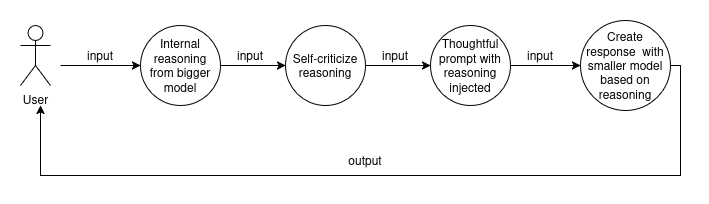

# Experiment: Inference-time Distillation

Developed in February 2025

## Introduction

In this small project I show the concept of how model distillation can be used during inference-time using explicit CoT and self-reflection.

The core difference to trained distillation is the persistence. The effect lasts only for the current context, but this could be conquered with fine-tuning to a certain degree.

Deepseek showed the positive effects in training, when the model expresses its thoughts explicitly. They also showed that distilled reasoning from a bigger model improves performance compared to the used base models.

Refer to the related papers [Deepseek-V3](https://arxiv.org/pdf/2412.19437) and [-R1](https://arxiv.org/pdf/2501.12948) for more information about the training techniques and effects.

There are crucial benefits of applying inference-time techniques compared to training.

- Possibility to use more than one model
- Environment-specific routing (refer to the project model router)
- Reasoning injection based on environment
- Much more dynamic intervention possibilities

Combining the approaches of routing and explicit reasoning yields a promising framework that could potentially tackle the problem of **overthinking** in reasoning systems, when further researched and developed.

Note: In the resources folder, you can find chat experiments I did, using a simple prompt to apply the idea of the framework in the most simple way. The chats show how an 8b-model (llama3.1) exhibits self-corrective behavior and indicates advanced reasoning capabilities, by self-assessing its own reasoning in intermediate explicit reasoning steps. Furthermore, the model indicates increased awareness of its own limitations, as the infinite library experiment shows. The experiments also reveal weaknesses, when looking at the first conversation pair of the math calculation experiment, for example. It clearly presents the problem of overthinking, which I would approach using both, model routing and inference-time distillation, as suggested above. Further research and experimentation is required to estimate the effectiveness of this framework at inference-time.

## Process



### Step 1

The input is fed to bigger model which is prompted to express
its internal reasoning for the solution, similiar to chain-of-thoughts.

### Step 2

The same model is prompted to critique the reasoning to improve the quality of the reasoning pattern, or fix mistakes.

### Step 3

The improved reasoning is now injected into the final prompt as reasoning trace. The prompt tells the smaller model to generate a final response based on the trace.

### Step 4

The smaller model now uses the enhanced reasoning trace, reflects on it and generates the final response.

## Usage

### Prerequisits

- running ollama endpoint
- downloaded models 'llama3.2:3b-instruct-q8_0' and 'llama3.1:8b'

### Linux

### Create & activate a virtual environment

```bash
python3 -m venv venv
```
```bash
source venv/bin/activate
```
### Install the dependencies

```bash
pip install -r requirements.txt
```
### Run the program

```bash
python3 src/main.py
```

### Windows

### Create & activate a virtual environment

```cmd
python -m venv venv
```
```cmd
venv\Scripts\activate
```
### Install the dependencies

```cmd
pip install -r requirements.txt
```
### Run the program

```cmd
python src\main.py
```
